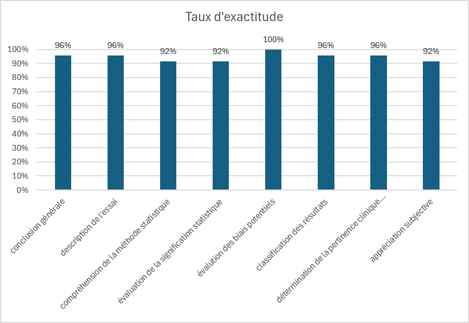

# SPIN-OFF — skills pour une analyse critique transparente et explicable des études cliniques, au-delà du [spins](https://sfpt-fr.org/livreblancmethodo/part1/file_17.htm)


**Un ensemble de skills fondés sur les standards méthodologiques pour guider les IA génératives dans l’analyse critique, transparente et explicable des études cliniques**


<p align="center">
    <a href="#installation">Installation</a> &bull;
    <a href="#comment-utiliser-ces-skills">Utilisation</a> 
</p>


Les skills mises à disposition ici permettent de doter les IA généralistes des compétences nécessaires pour analyser de manière critique et interpréter les résultats des études cliniques utilisées dans l'évaluation des interventions de santé (essais randomisés de supériorité ou d'infériorité, les études observationnelles inférentielles, Real World Evidence, les comparaisons indirectes, etc.).Elles assurent le transfert d'expertise pour éviter que les IA soient influencées par d'éventuels [spins de conclusion](https://sfpt-fr.org/livreblancmethodo/part1/file_17.htm) présents dans la publication analysée ou d'autres documents vus durant leur apprentissage.  

Ces skills permettent à votre IA de produire un rapport évaluant une étude à partir du pdf de l'article (et éventuellement du supplément, du protocole ou du SAP) en se basant sur une expertise validée. 

> [!IMPORTANT]
>_Attention, il convient de vérifier que l'IA que vous utilisez peut recevoir des pdf d'articles sans que cela enfreigne les dispositions légales en vigueur (ce qui pourrait avoir lieu si cette IA utilise les documents des documents pour leur apprentissage par exemple. Il y a souvent une option à cocher/décocher sur ce point.)_

## Skills disponibles

Les skills actuellement proposées (d'autres sont en développement) sont les suivantes.

| Nom | Version | Description et référence |
| --- | --- | --- |
| `analyse-critique-ecr` | V0.1 | Interprétation et analyse critique d'un essai randomisé de supériorité. Basée sur le document de la Société Française de Pharmacologie et de Thérapeutique sur la [lecture critique des essais thérapeutiques.](https://sfpt-fr.org/livreblancmethodo/part4/file_0.htm) |
| `analyse-marge-non-inferiorite` | V0.1 | Évalue les aspects méthodologiques reliés à la problématique de la limite de non-infériorité (marge de non-infériorité). Basée sur le [guide EMA](https://www.ema.europa.eu/en/documents/scientific-guideline/draft-guideline-non-inferiority-equivalence-comparisons-clinical-trials_en.pdf) en cours d'élaboration sur les essais de non-infériorité et le document de la [Société Française de Pharmacologie et de Thérapeutique](https://sfpt-fr.org/livreblancmethodo/source/dossier%206%20-%20essai%20de%20non-inf%C3%A9riorit%C3%A9.pdf)  |
| `analyse-critique-observationnelle-inferentielle` | V0.1 | Interprétation et analyse critique d'une étude observationnelle inférentielle (type RWE). Basée sur le travail de la table ronde des ateliers de Giens 2024 [Attentes méthodologiques pour la démonstration de l’efficacité des produits de santé par les études observationnelles](https://hal.science/hal-04812328v1/document) |
| `analyse-critique-comparaison-externe` | V0.1 | Interprétation et analyse critique d'une comparaison à un groupe contrôle externe (ECA external comparison arm). Basée sur le document de la [Société Française de Pharmacologie et de Thérapeutique](https://sfpt-fr.org/livreblancmethodo/source/GCE.pdf)  |
| `rob2-0` | draft | Évaluation du risque de biais d'un essai clinique randomisés à l'aide de l'outil [ROB 2.0](https://www.bmj.com/content/366/bmj.l4898)|
| `analyse-critique-maic` | V0.1 | Interprétation et analyse critique d'une comparaison indirecte de type MAIC (Matched Adjusted Indirect Comparison) ancrée ou non ancrée |
| audit-rapport-vs-avis-ct | V0.1 | Évalue la qualité de l'évaluation d'une étude faite par l'une de ces skills en utilisant comme benchmark l'avis de transparence portant sur la même étude. Nécessite de fournir le rapport d'analyse produit par la skill et le pdf de l'avis de transparence correspondant | 

>Ces skills sont encore en développement et sont susceptibles d'évoluer rapidement. Des mises à jour seront mis en ligne régulièrement. 

## Généralités sur les skills (compétences)

Les skills permettent d'apporter des compétences spécifiques aux agents et plateformes d'IA (comme Vibe de Mistral, chatGPT, Claude, antigravity, etc.). Elles permettent de compléter les capacités de ces outils généralistes avec des expertises de haut niveau spécifiques à une tache.
Il s'agit d'un [standard ouvert](https://agentskills.io/home) disponible maintenant sur presque toutes les IA.


## Comment utiliser ces skills

Une fois [installées,](#installation) les skills se déclenchent automatiquement lorsqu'un prompt demande une tache qui est couverte par les skills. Par exemple après avoir téléchargé le pdf d'un article d'essais clinique et demandé d'analyser ou d'interpréter cette étude, l'AI détectera que cette demande correspond à la skill `analyse-critique-ecr` et l'utilisera pour répondre à la demande de l'utilisateur.

Vous pouvez aussi demander explicitement l'exécution d'une skill pour votre prompt à l'aide de la commande '/' suivi du nom de la skill, comme par exemple :
```
/analyse-critique-ecr analyse cet essai clinique
```


## Installation

Pour installer ces skills sur votre outil habituel (Vibe de Mistral, chatGPT, Claude, antigravity, etc.) posez-lui la question dans un prompt.

```
Comment installer les skills disponibles dans le GitHub cucheratmi/_skills 
```

ou plus directement 

```
Installe les skills disponibles dans le Github cucheratmi/_skills (https://github.com/cucheratmi/_skills)
```

Si vous souhaitez n’installer qu'une skill particulière, le préciser dans le prompt d'installation.

Il est possible d'installer les skills sans passer par les prompts. En fonction des AI cela peut se faire à l'aide du menu  (Claude, chatGPT) ou en recopiant ces fichiers dans des répertoires dédiés.

> [!WARNING]
>_Il est important d'analyser le contenu des skills avant de les installer pour écarter la possibilité de skill malveillante (par injection de prompt). Les IA font une analyse avant de faire l'installation, mais rien ne vaut une inspection visuelle du contenu de la skill._


## Intérêts des skills 

Il est possible de demander à une IA d'analyser une étude clinique et d'interpréter ses résultats à partir du pdf de l'article avec un simple prompt du type "Quelles sont les limites méthodologiques de cette étude" ou "Que démontre cette étude ?". Mais l'analyse qui sera produite soulèvera un questionnement quant à la façon dont elle a été effectuée. Quels sont ses critères utilisés pour rejeter ou accepter un résultat, sur quelles bases ont été évalués les biais de l'étude, l'approche utilisée est-elle rigoureuse ? etc. Cette analyse, sortie d'une "boite noire", sera peu explicable. De plus, cette analyse ne sera certainement pas que le résultat de l'analyse rigoureuse et impartiale de la publication, mais sera influencée par la discussion et la conclusion des auteurs, avec éventuellement la reprise des spins de conclusion, et intégrera aussi les commentaires externes qui auront été ingurgités par l'IA lors de son apprentissage.

Les skills permettent de contrôler avec beaucoup de précision la façon dont l'article sera analysé au niveau méthodologique, statistique et clinique. Elles permettent aussi d'apporter les connaissances de  base nécessaires pour effectuer ces tâches et de spécifier les critères et les seuils à utiliser pour juger si un résultat est fiable ou non.  

Les skills assurent aussi la transparence et l'explicabilité de l'analyse. Ce sont de simples fichiers textes qui donnent les instructions à l'IA pour réaliser l'analyse en langage naturelle. Ils sont donc parfaitement lisibles et permettent de connaître la façon dont l'analyse sera effectuée et sur la base de quelle doctrine.


L'expertise apportée par ces skills court-circuite l'approche naïve que pourrait avoir une IA généraliste sur cette tache. Cette approche basée sur une compétence parfaitement explicitée dans les skills garantit une évaluation parfaitement transparente (explicable), contrairement aux productions standards des IA. De même les skills demande à l'IA de ne se baser que sur la publication et de ne pas tenir compte d'analyses ou de commentaires externes sur cette étude qu'elle pourrait avoir ingurgitée leur de son apprentissage. Cela permet d'éviter, par exemple, que la communication promotionnelle concernant le traitement évalué interfère avec l'analyse de l'étude.   
Il est aussi demandé que l'interprétation ne tient pas compte de la conclusion et de la discussion des auteurs afin d'éviter les intoxications par les spins de conclusion qui pourraient être présents dans les publications.


## Validation 

La skill d'évaluation des essais cliniques a été évaluée à l'aide d'un benchmark de 24 essais. Le taux d’exactitude sur les différents domaines évalués varie de 92% à 100%. 



Ces résultats ont été obtenus avec claude sonnet 5 high. Ce niveau de performance peut cependant être différent avec d'autres du LLM, ou niveau d'utilisation, ou harnais. Les évolutions technologiques sur ces éléments étant tellement rapide qu'une évaluation a un moment donné ne préjugera pas de la performance de ces skills ultérieurement ou avec un nouveau modèle ou un nouveau harnais.

Ces skills ne sont qu'un outil pour faciliter le travail d'évaluation de ces études ou pour faire bénéficier des lecteurs non méthodologistes d'une expertise renforcée. En aucun cas, ces outils ne doivent être considérés comme infaillibles. En particulier, ils peuvent ne pas comprendre des méthodes très inhabituelles ou des rédactions peu précises. De plus, comme nous, ils ne peuvent pas détecter la fraude bien faite. 


## Contributeurs
(GT methodo SFPT à preciser)
- Michel Cucherat
- Charles Khoury
- Silvy Laporte
- Clara Locher
- Matthieu Roustit

## Utilisation

L'utilisation de ces skills nécessite de vérifier que le téléchargement sur l'outil d'IA des pdf des articles n'enfreint pas la législation en vigueur, par exemple en s'assurant dans le paramétrage et les conditions d'utilisation que les documents de l'utilisateur ne sont pas utilisés pour l'apprentissage du LLM. 

## Références

- Société Française de Pharmacologie te de Thérapeutique. Livre blanc - De la nécessité de la méthodologie dans l’évaluation des médicaments. https://sfpt-fr.org/livreblancmethodo/index.htm (accessed 4 September 2026)
 
- Cucherat M, Demarcq O, Chassany O, et al. Attentes méthodologiques pour la démonstration de l’efficacité des produits de santé par les études observationnelles. Therapies. 2025;80:33–46. doi: 10.1016/j.therap.2024.10.052

- Sterne JAC, Savović J, Page MJ, et al. RoB 2: a revised tool for assessing risk of bias in randomised trials. BMJ. 2019;366:l4898. doi: 10.1136/bmj.l4898

- Vanier A, Fernandez J, Kelley S, *et al.* Rapid access to innovative medicinal products while ensuring relevant health technology assessment. Position of the French National Authority for Health. *BMJ Evid Based Med* 2023. [PMC10850619](https://pmc.ncbi.nlm.nih.gov/articles/PMC10850619/)

- Methodological Guideline for Quantitative Evidence Synthesis: Direct and Indirect Comparisons (Joint Clinical Assessment, Commission européenne). [PDF](https://health.ec.europa.eu/document/download/4ec8288e-6d15-49c5-a490-d8ad7748578f_en?filename=hta_methodological-guideline_direct-indirect-comparisons_en.pdf)

- Practical Guideline for Quantitative Evidence Synthesis: Direct and Indirect Comparisons (Joint Clinical Assessment, Commission européenne). [PDF](https://health.ec.europa.eu/document/download/1f6b8a70-5ce0-404e-9066-120dc9a8df75_en?filename=hta_practical-guideline_direct-and-indirect-comparisons_en.pdf)

- NICE DSU Technical Support Document 18 — Methods for population-adjusted indirect comparisons in submissions to NICE (Phillippo *et al.*, 2016). [PDF](https://sheffield.ac.uk/media/34216/download)

- [Livre blanc SFPT — Essai de non-infériorité](https://sfpt-fr.org/livreblancmethodo/source/dossier%206%20-%20essai%20de%20non-inf%C3%A9riorit%C3%A9.pdf)

- Société Française de Pharmacologie et de Thérapeutique (SFPT), Groupe de Travail Méthodologie. *Comparaisons à un groupe contrôle externe* — Document de synthèse, version 1.0, avril 2026.

- FDA/CDER/CBER. *Considerations for the Design and Conduct of Externally Controlled Trials for Drug and Biological Products* — Guidance for Industry. [PDF](https://www.fda.gov/media/164960/download)

- ICH E10. *Choice of Control Group in Clinical Trials* — définition de référence de l'*externally controlled trial*.

- Cashin AG, Hansford HJ, Hernán MA, et al. Transparent Reporting of Observational Studies Emulating a Target Trial — The **TARGET** Statement. *JAMA* 2025.

- Sterne JA, Hernán MA, Reeves BC, et al. **ROBINS-I** : a tool for assessing risk of bias in non-randomised studies of interventions. *BMJ* 2016;355:i4919.

- Bykov K, Jaksa A, Lund JL, et al. **APPRAISE** : A Tool for Appraising Potential for Bias in Real-world Evidence Studies on Medication Effectiveness or Safety. *Value Health* 2025.

- VanderWeele TJ, Ding P. Sensitivity Analysis in Observational Research: Introducing the **E-Value**. *Ann Intern Med* 2017;167:268–74.

- Desai RJ, Wang SV, Sreedhara SK, et al. Process guide for inferential studies using healthcare data from routine clinical practice to evaluate causal effects of drugs (**PRINCIPLED**). *BMJ* 2024;384:e076460.


